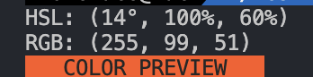

# hsl2r

**hsl2r** is a CLI tool that converts hsl to rgb.


## Quick Start

Get **hsl2r** up and running quickly!

1. **Run**:
    ```bash
    npx hsl2r 14 100 60
    ```
2. **Done!**

### Example Output

This will convert the HSL values `(14°, 100%, 60%)` to its RGB equivalent, and display a color preview in your terminal.

- **Input**: `14 100 60`
- **Output**: `RGB: (255, 87, 51)`
- **Color Preview**: `COLOR PREVIEW (in the specified color)`



## Contributing

We welcome contributions to **hs2rc**! Whether it's reporting a bug, suggesting an enhancement, or submitting a pull request, your input is valued.

## License

This project is licensed under the MIT License - see the [LICENSE](LICENSE) file for details.

## Contact

For any questions, suggestions, or feedback, please contact [love1ace](mailto:lovelacedud@gmail.com).